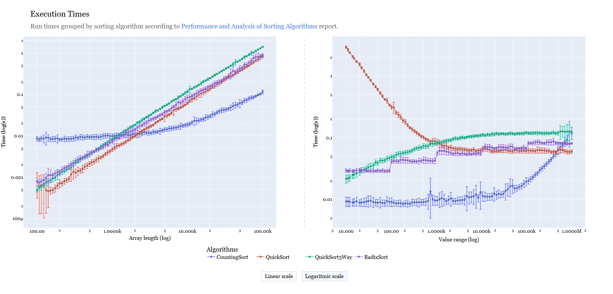

This project analyzes the performance of various sorting algorithms under varying conditions of array size and entropy.

---

## Interactive Plot

Explore the runtime measurements and comparisons:

<a href="https://londero-lorenzo.github.io/SortingAlgorithms/assets/benchmarks.html" target="blank">View the interactive performance plot
	
</a>
---

## Technical Report

Read the full documentation and methodology in our report:

<a href="https://londero-lorenzo.github.io/SortingAlgorithms/Prestazioni_ed_Analisi_di_Algoritmi_di_Ordinamento.pdf" target="blank">View the PDF Report [ITA]</a>

---

## About the Data

The benchmark was conducted on datasets generated under two distinct configurations:

- **Length variability**: Arrays with increasing sizes (from 100 to 100,000 elements), using a fixed value range.
<a href="https://londero-lorenzo.github.io/SortingAlgorithms/assets/benchmark_on_length.html" target="blank">View the interactive performance plot</a>.

- **Value variability**: Arrays of fixed length, but varying number of distinct elements (from 10 to 1,000,000).
<a href="https://londero-lorenzo.github.io/SortingAlgorithms/assets/benchmark_on_numbers.html" target="blank">View the interactive performance plot</a>.

All arrays are generated deterministically using seed-based sampling, ensuring full reproducibility of results.

---

## Measurement Configuration

Execution times are measured using an adaptive method based on the system's clock resolution.  
Each sorting algorithm is tested on **100 samples per configuration**, each repeated **60 times**.

Key measurement details:

- Minimum duration (`minTime`) is calibrated to avoid timer resolution errors.
- For each sample, **median**, **interquartile range (IQR)**, and outliers are computed.
- Asymmetric error bars are used to reflect the true spread of the distribution.

---

## Algorithms Benchmarked

The following algorithms were analyzed:

- QuickSort (2-way partition)
- QuickSort (3-way partition)
- CountingSort
- RadixSort

---

## <a href="https://github.com/londero-lorenzo/SortingAlgorithms" target="blank">GitHub Repository →</a>
